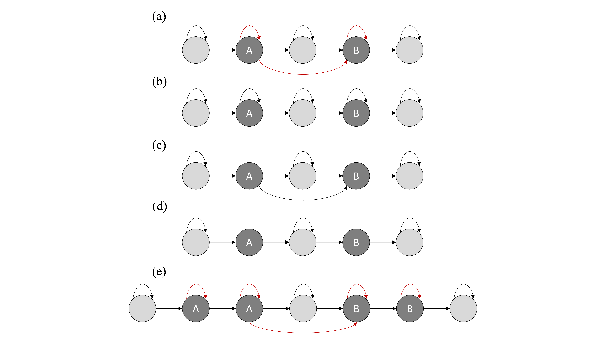
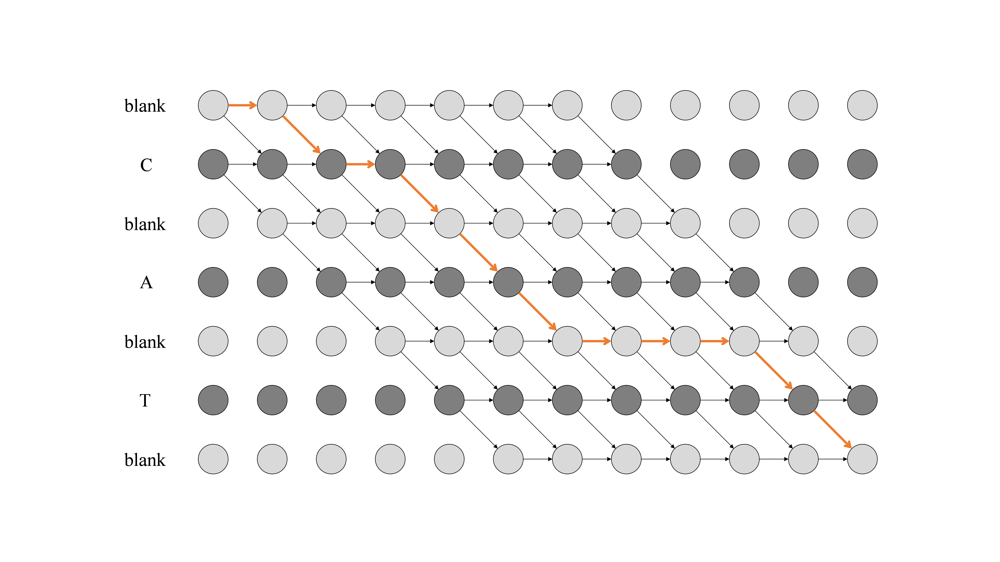
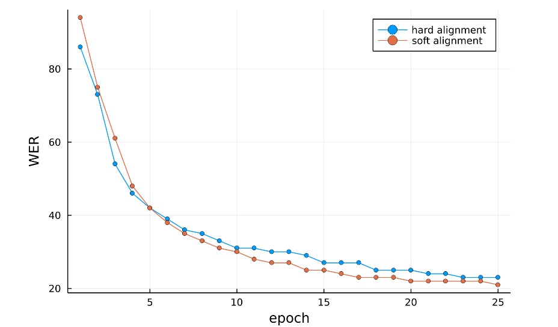

# 
Viterbi Accelerated Training for CTC Series Topologies

Taiyang Zhao

#### 
Abstract

Connectionist Temporal Classification (CTC) is an alignment free technique designed for temporal classification tasks. Under the maximum likelihood framework, the CTC probability of a label sequence given the input sequence is calculated by summing over all the feasible paths, the summation is performed via the forward-backward algorithm which could be viewed as soft alignment. This paper introduces a method to accelerate the training of CTC series criteria by Viterbi hard alignment, where the CTC probability is approximately calculated by the most likely path. On the thchs30 speech recognition task, it is shown that hard alignment criteria could achieve similar word error rate (WER) while consuming about 1/4 computation time compared with the soft alignment criteria.

Keywords: CTC, Viterbi alignment, Soft alignment

## 1. Introduction

Connectionist Temporal Classification (CTC) [\[1\]](#ref1), as its name suggests, is an end-to-end training criteria for sequential labelling tasks. To predict two consecutive same labels and absorb the noninformative segments, CTC inserts blank labels before every label and at the end of label sequence. In theory, we do not know where the labels would occur, so the CTC probability of a label sequence given the input sequence is computed by summing over all the feasible paths. In order to handle the exponential number of possible paths, the summation is performed via the forward-backward algorithm [\[2\]](#ref2) where the soft alignment could be obtained. Due to the differentiable of all the basic operations in the forward-backward algorithm, we could optimize the model by gradient based framework.

In this paper, a method to accelerate the training of CTC and its variations is introduced, where the probability of a label given the input is calculated by the most likely path evaluated by the Viterbi hard alignment algorithm [\[2\]](#ref2). It is clear that the hard-alignment loss is the upper bound of the soft-alignment loss. To illustrate the Viterbi training, we used a simple variant of CTC topology as show in Figure 1 (b).

## 2. CTC Series Topologies

### 2.1. Connectionist Temporal Classification

The log-likelihood of a given training set $\mathrm{S}$ is defined as

$$
O_{\mathrm{ML}}(\mathrm{S})=\ln \prod_{(\boldsymbol{x}, \mathbf{z}) \in \mathrm{S}} p(\mathbf{z} \mid \boldsymbol{x}, \theta)=\sum_{(\boldsymbol{x}, \mathbf{z}) \in \mathrm{S}} \ln p(\mathbf{z} \mid \boldsymbol{x}, \theta)
$$

where $\boldsymbol{x}=x_{1: T}$ is the feature sequence, $\boldsymbol{z}$ is the transcription sequence, and $\theta$ is the model parameters which will be omitted later for clarity. By extending the transcription sequence $\mathbf{z}$ to $\boldsymbol{l}$ which is allowed by the CTC topology show in Figure 1 (a), we can write the score function for a sample pair as

$$
\begin{aligned}
p(\boldsymbol{z} \mid \boldsymbol{x}) & =p(\boldsymbol{l} \mid \boldsymbol{x}) \\
& =\sum_{\boldsymbol{h}} p(\boldsymbol{l}, \boldsymbol{h} \mid \boldsymbol{x}) \\
& =\sum_{i}\left(\sum_{\boldsymbol{h}} p(\boldsymbol{l}, \boldsymbol{h} \mid \boldsymbol{x})\right) \delta_{h_{t}, l_{i}} \\
& =\sum_{i} p\left(\boldsymbol{l}, h_{t}=l_{i} \mid \boldsymbol{x}\right) \\
& =\sum_{i} \alpha_{t}^{i} \beta_{t}^{i}
\end{aligned}
$$

where $\boldsymbol{h}$ is the hidden state sequence also known as path, $\alpha$ and $\beta$ are the forward-backward variables defined as

$$
\begin{array}{ccc}
\alpha_{t}^{i}=p\left(h_{1: t}, h_{t}=l_{i} \mid \boldsymbol{x}\right) \quad \\
\beta_{t}^{i}=p\left(h_{t+1: T} \mid h_{t}=l_{i}, \boldsymbol{x}\right)
\end{array}
$$

$$
s.t. 
    \left\{\begin{matrix} 
    M\left(h_{1: t}\right)=l_{I: i} \\  
    M\left(h_{t: T}\right)=l_{i: F} 
    \end{matrix}\right. 
$$

respectively, in which $I$ is one of the initial states, $F$ is one of the ending states and $\mathrm{M}(\cdot)$ is a function that merges the consecutive repeated labels. Finally, the derivative of $\ln p(\boldsymbol{z} \mid \boldsymbol{x}, \theta)$ with respect to the posterior of state $k$ at time-step $t$ is used to optimize parameters, see appendix for details.

### 2.2. Simple CTC

The Simple-CTC, as shown in Figure 1 (b), differs from the normal CTC by removing the connection between non-blank labels. This modification leads the model tending to separate the non-blank labels by at least one blank label, in speech and handwriting recognition tasks, there are usually non-informative regions between labels, so this tendency has negligible affection on both training and prediction, and it is convenient for writing a simple code both on CPU and GPU.

### 2.3. Spiky CTC

The Spiky-CTC, as shown in Figure 1 (c), removes the self-loop of the non-blank labels of normal CTC. This is consistent with the spiky behavior of normal CTC, also mentioned in [\[3\]](#ref3).

### 2.4. Mini CTC

The Mini-CTC, as shown in Figure 1 (d), further removes the transition between the non-blank labels of Spiky-CTC. On the one hand, it endorses the spiky behavior, on the other hand, it also trends to gap the non-blank labels by blank during prediction.

### 2.5. Repeated CTC

In Repeated-CTC, the non-blank labels could be repeated for more than one time as needed. This repeating behavior leads the model to repeat every non-blank symbol for more than one time during inference. The self-loop and non-blank transitions could also be removed alternatively as noted in Figure 1 (e). Those topology variants are similar to the duration-limited CTC in [\[3\]](#ref3) and [\[4\]](#ref4).

  

    
    Figure 1. Example CTC and its variants topologies for a vocabulary {blank, A, B}. (a) CTC, (b) Simple-CTC, (c) Spiky-CTC, (d) Mini-CTC, and (e) Repeated-CTC topologies for sequential label 'AB'. The gray circle stands for blank label and the dark red arcs could be removed alternatively to create new topologies.
    

## 3. Viterbi Training

The Viterbi path $\boldsymbol{\pi}=\pi_{1: T}$, as illustrated in Figure 2, is one of the valid paths, thus the probability of all possible paths is always not less than the probability of the Viterbi path, so we have the following formula

$$
p(\boldsymbol{z} \mid \boldsymbol{x})=\sum_{\boldsymbol{h}} p(\boldsymbol{l}, \boldsymbol{h} \mid \boldsymbol{x}) \geq p(\boldsymbol{l}, \boldsymbol{\pi} \mid \boldsymbol{x})
$$

However, most paths would fade during training, so $p(\boldsymbol{l}, \boldsymbol{\pi} \mid \boldsymbol{x})$ gradually approaches $p(\boldsymbol{z} \mid \boldsymbol{x})$. Suppose the posterior of state $k$ at time-step $t$ is $y_{t}^{k}$, then the derivative of score with respect to $y_{t}^{k}$ is approximate to

$$
\frac{\partial \ln p(\boldsymbol{l}, \boldsymbol{\pi} \mid \boldsymbol{x})}{\partial y_{t}^{k}}=\frac{1}{p(\boldsymbol{l}, \boldsymbol{\pi} \mid \boldsymbol{x})} \frac{\partial p(\boldsymbol{l}, \boldsymbol{\pi} \mid \boldsymbol{x})}{\partial y_{t}^{k}}=\frac{\delta_{k, \pi_{t}}}{y_{t}^{k}}
$$

where $\delta_{k, \pi_{t}}$ is the Viterbi alignment path, see appendix for details. From the above equation, we can get another perspective by

$$
-\frac{\delta_{k, \pi_{t}}}{y_{t}^{k}}=\frac{\partial}{\partial y_{t}^{k}}\left(-\delta_{k, \pi_{t}} \ln y_{t}^{k}\right)=\frac{\partial}{\partial y_{t}^{k}} \mathrm{CrossEntropy}(\boldsymbol{\delta}, \boldsymbol{y})
$$

That is to say, CTC criteria is an expectation-maximum-like iterative algorithm also mentioned in [\[5\]](#ref5) and [\[6\]](#ref6), where the posterior of the hidden state sequence estimated by soft or hard alignment is pseudo label.

  

    
    Figure 2. Trellis of the labelling 'CAT' allowed by the Simple CTC Topology. The bold orange line indicates the Viterbi path.
    

## 4. Experiments

The experiments were conducted on a public mandarin speech corpus thchs30 [\[7\]](#ref7), it has 212 subtoned-pinyin. For all experiments, 64-dimentional Fbank features computed every $8 \mathrm{~ms}$ on $16 \mathrm{~ms}$ window were used. The architecture of network for all models are the same, as shown in Table 1.

Table 1. Configuration of the network

|     Layer type     | Output channels | (Kernel, Stride) | Activation of Conv1d |
| :----------------: | :-------------: | :--------------: | :------------------: |
| Conv1d + BatchNorm |       512       |      (5, 3)      |         relu         |
| Conv1d + BatchNorm |       512       |      (3, 1)      |         relu         |
| Conv1d + BatchNorm |       512       |      (3, 1)      |         relu         |
| Conv1d + BatchNorm |       512       |      (3, 1)      |         relu         |
|       Conv1d       |       213       |      (1, 1)      |       softmax        |

For a fair comparison, the Simple-CTC topology was chosen for both soft-alignment trained model and the proposed hard-alignment trained model. Adam optimizer with learning rate of 2e-4 was adopted for 25 epochs. Sub-pinyin error rate, referred as WER for clarity, was used to evaluate the performance of different training methods. The training process on development data set was illustrated in Figure 3. We noticed the hard-alignment training has similar convergence property as soft-alignment training. Finally, models had the best dev-data-set performance were chosen. The greedy search decoding strategy was employed to evaluate the acoustic model performance, the WER of hard alignment training was $30.88 \%$ while the WER of soft alignment training was $29.04 \%$.

  

    
    Figure 3. Soft vs hard alignment training based on Simple-CTC topology on the dev data set.
    

## 5. Conclusion

This paper proposed a hard-alignment training method for CTC criteria and its variations. Experiments show that the proposed method can achieve similar WER performance while consuming about 1/4 calculating time compared with the soft-alignment training criteria. In some novel applications of CTC criteria, like applying CTC into hierarchical systems to learn multiscale structure at different levels [\[8\]](#ref8) or for regularization [\[9\]](#ref9), hard-alignment training would also be employed to speed up training. What is more, the hard alignment training for CTC series topologies can cooperate with the weighted finite states transducer framework where the prior linguistic information could be easily get involved to improve the model performance. In the future, we would try to train a bigger model with a larger data set to further develop its potential.

## 6. References

<h4 id="ref1"></h4>
[1]. Graves A. Supervised Sequence Labelling with Recurrent Neural Networks. 2013.
<h4 id="ref2"></h4>
[2]. Rabiner, R L. A tutorial on hidden Markov models and selected applications in speech recognition[J]. Proceedings of the IEEE, 1989.
<h4 id="ref3"></h4>
[3]. Hannun A, Pratap V, Kahn J, et al. Differentiable Weighted Finite-State Transducers:, 10.48550/arXiv.2010.01003[P]. 2020.
<h4 id="ref4"></h4>
[4]. Raissi T, Zhou W, Berger S, et al. HMM vs. CTC for Automatic Speech Recognition: Comparison Based on Full-Sum Training from Scratch[J]. arXiv e-prints, 2022.
<h4 id="ref5"></h4>
[5]. Li H, Wang W. Reinterpreting CTC-based Training as Iterative Fitting[J]. Pattern Recognition, 2020, 105(5):107392.
<h4 id="ref6"></h4>
[6]. L. Gao, H. Zhang, and C. Liu, "Regularizing CTC in expectation-maximization framework with application to handwritten text recognition," in International Joint Conference on Neural Networks, IJCNN 2021, Shenzhen, China, July 18-22, 2021. IEEE, 2021, pp. 1-7.
<h4 id="ref7"></h4>
[7]. Wang D, Zhang X. THCHS-30: A Free Chinese Speech Corpus.[J]. arXiv e-prints, 2015.
<h4 id="ref8"></h4>
[8]. Lee J, Watanabe S. Intermediate Loss Regularization for CTC-based Speech Recognition:, 10.1109/ICASSP39728.2021.9414594[P]. 2021.
<h4 id="ref9"></h4>
[9]. Santiago Fern andez, Alex Graves, and J ürgen Schmidhuber, "Sequence labelling in structured domains with hierarchical recurrent neural networks," in Proc. IJCAI, 2007.

## 7. Appendix

The derivative of CTC score with respect to the posterior of state $k$ at time-step $t$ is

$$
\frac{\partial \ln p(\boldsymbol{z} \mid \boldsymbol{x})}{\partial y_{t}^{k}}=\frac{\partial \ln p(\boldsymbol{l} \mid \boldsymbol{x})}{\partial y_{t}^{k}}=\frac{1}{p(\boldsymbol{l} \mid \boldsymbol{x})} \frac{\partial p(\boldsymbol{l} \mid \boldsymbol{x})}{\partial y_{t}^{k}}
$$

of which

$$
\begin{aligned}
\frac{\partial p(\boldsymbol{l} \mid \boldsymbol{x})}{\partial y_{t}^{k}} & =\frac{\partial \sum_{j} \alpha_{t}^{j} \beta_{t}^{j}}{\partial y_{t}^{k}} \\
& =\frac{\partial \sum_{j}\left(\sum_{i} \alpha_{t-1}^{i}\right) y_{t}^{l_{j}} \beta_{t}^{j}}{\partial y_{t}^{k}} \\
& =\sum_{j}\left(\sum_{i} \alpha_{t-1}^{i}\right) \delta_{k, l_{j}} \beta_{t}^{j} \\
& =\frac{\sum_{j}\left(\sum_{i} \alpha_{t-1}^{i}\right) y_{t}^{l_{j}} \beta_{t}^{j}}{y_{t}^{k}} \delta_{k, l_{j}} \\
& =\frac{1}{y_{t}^{k}} \sum_{j} \alpha_{t}^{j} \beta_{t}^{j} \delta_{k, l_{j}}
\end{aligned}
$$

combine the two formulas above, we have

$$
\frac{\partial \ln p(\boldsymbol{z} \mid \boldsymbol{x})}{\partial y_{t}^{k}}=\frac{1}{y_{t}^{k}} \sum_{j} \frac{\alpha_{t}^{j} \beta_{t}^{j}}{\sum_{i} \alpha_{t}^{i} \beta_{t}^{i}} \delta_{k, l_{j}}
$$

Similarly, the derivative of Viterbi path score with respect to $y_{t}^{k}$ is

$$
\begin{aligned}
\frac{\partial \ln p(\boldsymbol{l}, \boldsymbol{\pi} \mid \boldsymbol{x})}{\partial y_{t}^{k}} & =\frac{1}{p(\boldsymbol{l}, \boldsymbol{\pi} \mid \boldsymbol{x})} \frac{\partial p(\boldsymbol{l}, \boldsymbol{\pi} \mid \boldsymbol{x})}{\partial y_{t}^{k}} \\
& =\frac{1}{p(\boldsymbol{l}, \boldsymbol{\pi} \mid \boldsymbol{x})} \frac{\partial p\left(\boldsymbol{l}, \pi_{t} \mid \boldsymbol{x}\right)}{\partial y_{t}^{k}} \prod_{\tau \neq t} p\left(\boldsymbol{l}, \pi_{\tau} \mid \boldsymbol{x}\right) \\
& =\frac{1}{p(\boldsymbol{l}, \boldsymbol{\pi} \mid \boldsymbol{x})} \delta_{k, \pi_{t}} \prod_{\tau \neq t} p\left(\boldsymbol{l}, \pi_{\tau} \mid \boldsymbol{x}\right) \\
& =\frac{1}{p(\boldsymbol{l}, \boldsymbol{\pi} \mid \boldsymbol{x})} \delta_{k, \pi_{t}} \prod_{\tau} \frac{p\left(\boldsymbol{l}, \pi_{\tau} \mid \boldsymbol{x}\right)}{y_{t}^{k}} \\
& =\frac{\delta_{k, \pi_{t}}}{y_{t}^{k}}
\end{aligned}
$$
